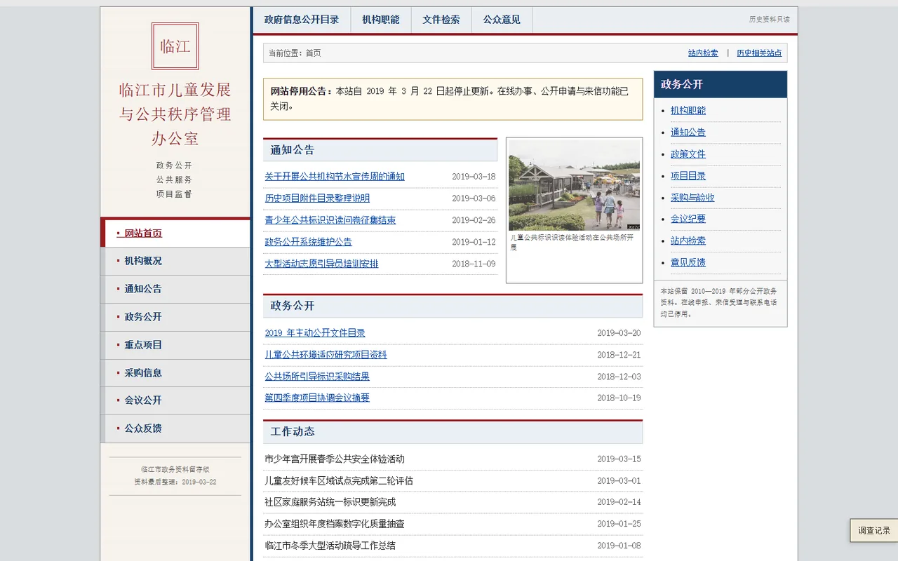

# 星河乐园

### GALAXY PARK

**一部从停运乐园旧官方网站开始的网页调查型 ARG**

[开始调查](https://yukirinss.github.io/galaxy-park-arg/) · [无剧透玩家说明](README_PLAYER.md)

---

## 游玩前说明

### 虚构互动作品说明

《星河乐园（Galaxy Park）旧官方网站》是一部完全虚构的互动悬疑作品。所有城市、政府部门、企业、人物和研究项目均不存在，本作品与任何现实机构和事件无关。

- 作品包含虚构的行为控制、心理干预、未成年人研究、隐私侵犯和政府档案隐瞒情节。
- 作品不包含鬼脸、血腥图片、突然惊吓、抖屏、大音量音效或自动播放音频；档案后段包含缓慢闪动的邮件状态与安全拦截页面。
- 网站不会获取摄像头、麦克风、位置、IP 地址或现实身份，也不会上传任何个人资料。
- 游玩进度只保存在当前浏览器的本地存储中，可随时清除。
- 部分明确标注的剧情选择，可能使玩家扮演的虚构角色加入后续研究。

### 文件安全与来源免责声明

> [!IMPORTANT]
> 本仓库及官方网站提供的游戏文件不含病毒、木马、挖矿程序、恶意宏、自动运行程序或其他恶意内容。项目不会要求玩家运行 `EXE`、`MSI`、`BAT`、`CMD`、`PS1`、`SCR`、`APK` 等可执行文件，也不会要求关闭杀毒软件或绕过系统安全警告。

本游戏使用的附件类型包括 PDF、DOCX、TXT、CSV、ZIP 和图片文件。DOCX 附件不包含宏；加密 ZIP 仅用于游戏谜题，压缩包内只包含可阅读的 CSV 与 TXT 文件。部分浏览器或在线扫描服务无法检查加密压缩包，这种提示本身不代表文件含有病毒，玩家应在确认来源无误后再使用游戏内获得的密码解压。

以下两个地址是本作品当前唯一认可的官方发布来源：

- GitHub 仓库：<https://github.com/YukiRinss/galaxy-park-arg>
- 在线游戏：<https://yukirinss.github.io/galaxy-park-arg/>

对于从上述官方地址直接访问或下载、且未经第三方修改的文件，作者负责其发布内容的安全检查与完整性维护。若官方文件被确认存在安全问题，作者将负责核验、修正或下架相关内容，并在仓库中说明处理情况。

通过网盘转存、聊天软件转发、论坛附件、重新打包压缩包、短链接或其他第三方渠道取得的副本，可能已经被改名、替换、插入额外文件或进行二次修改，作者无法确认其内容，也不对这类非官方副本承担责任。来源不明时，请不要直接点击、运行或解压；尤其不要运行任何与本仓库文件类型不符的可执行程序。

如果收到他人转发的游戏文件，建议先核对文件名和扩展名，使用本地安全软件扫描，并回到官方仓库重新下载对应原始文件。任何要求提供系统权限、管理员权限、浏览器账号、现实身份资料，或要求关闭安全防护的版本，都不是本作品的官方版本。

## 游戏背景

星河乐园于 1999 年正式营业，曾是临江市许多家庭共同的周末去处。2018 年 10 月，乐园在没有充分预告的情况下永久闭园，只留下一个停止更新的旧官方网站。

多年后，你偶然打开了这份网站备份。闭园公告、游客留言、活动节目单和旧照片看起来都很普通，但一些日期、文件编号和人们对同一场活动的记忆始终无法彼此对应。随着调查深入，一座地方乐园、一批没有被公开说明用途的儿童活动，以及一套仍在运转的档案系统逐渐产生了联系。

你需要浏览网页、核对记录、下载历史附件并解开散落其中的谜题，判断哪些事情真实发生过，又有哪些记忆只是被反复讲述之后留下的结果。

## 游戏画面

<table>
  <tr>
    <td width="50%"></td>
    <td width="50%"></td>
  </tr>
  <tr>
    <td align="center">星河乐园旧官方网站</td>
    <td align="center">临江市政务网站</td>
  </tr>
</table>

## 游戏特点

| 特点 | 内容 |
| --- | --- |
| 多站点调查 | 在旧乐园官网、地方政务网站和隐藏档案系统之间交叉核对信息，每个站点都有独立的年代感与排版风格。 |
| 网页原生解谜 | 无需安装客户端，谜题直接结合页面、图片、地图、节目单、编号和档案内容展开。 |
| 真实可读附件 | 调查过程中可以下载并打开 PDF、DOCX、TXT 和加密 ZIP；文件不是装饰，而是推理链的一部分。 |
| 渐进式调查记录 | 未发现的内容会保持为问号，线索只会随着探索逐步写入；主要问题均提供三级提示。 |
| 本地进度 | 进度只保存在当前浏览器的 `localStorage` 中，不需要注册真实账户，也不会上传个人信息。 |
| 多重结局 | 最终选择与证据完整度共同决定调查结果，共有三个结局及对应后续内容。 |

## 关于恐怖元素

**本作不是恐怖游戏，也不包含超自然内容。**

游戏中没有鬼怪、怪物、血腥画面、突然跳脸、闪屏、抖屏、大音量音效或自动播放音频，也不会调用摄像头、麦克风、位置、IP 地址或其他现实身份信息。

作品的紧张感来自文件之间的矛盾、冷静的档案语言和逐渐失去可信度的公共记录。剧情涉及完全虚构的未成年人研究、行为干预、记忆影响、隐私侵犯和档案隐瞒等主题，部分文字可能带来压迫感，但不会通过视觉惊吓制造恐怖效果。

## 游玩建议

- 推荐使用最新版 Edge、Chrome 或 Firefox，并在电脑端游玩。
- 完整体验通常需要 60 至 100 分钟，调查进度会自动保存在浏览器中。
- 建议允许浏览器下载附件，并留意反复出现的日期、编号、附件序号和措辞差异。
- 遇到停滞时可以打开右下角的“调查记录”，逐级查看提示。
- 请从游戏入口开始，不要直接浏览仓库文件，以免提前看到隐藏页面或谜题结构。

---

作者：[**凛雪** YukiRins](https://space.bilibili.com/1806769398?spm_id_from=333.1007.0.0)

感谢每一位愿意走进星河乐园、阅读旧文件并亲手拼出答案的玩家。

